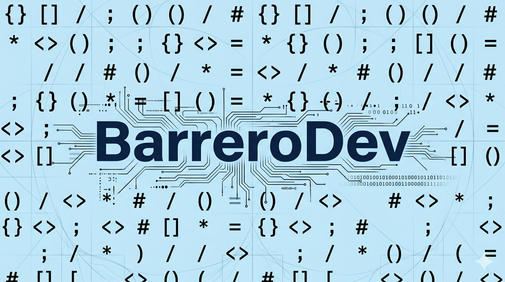
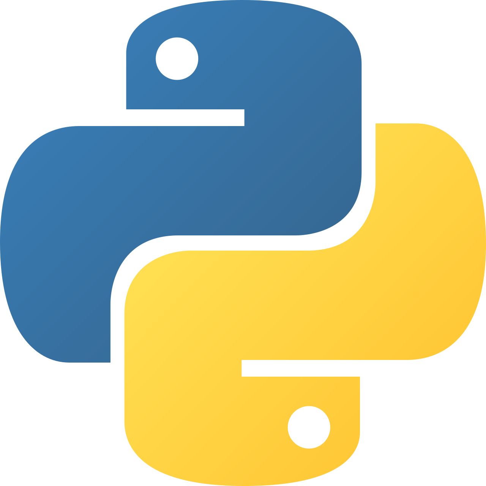
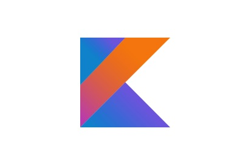
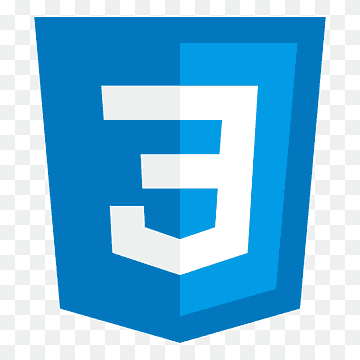

<h1 align="center"><b>Hola, soy BarreroDev </b></h1>

<h2>​📚​ My skills</h2>

<picture>   </picture> Programming languages:

  
  
  
  

 

<picture>   </picture> Frontend Development:

  
  
  

