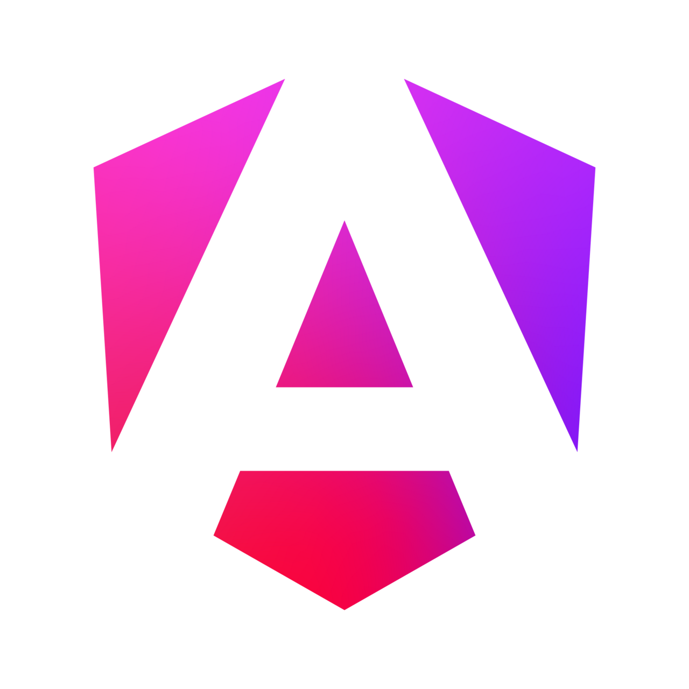
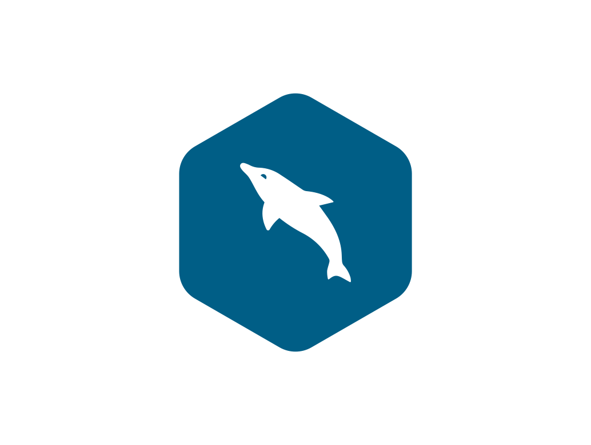

<h1 align="center"><b>Hola, soy BarreroDev </b></h1>

<h2>​🛠️ Mis Tecnologías y Herramientas</h2>

<h4>💻 Frontend Development</h4>

  &nbsp;&nbsp;&nbsp;&nbsp;
  &nbsp;&nbsp;&nbsp;&nbsp;
  &nbsp;&nbsp;&nbsp;&nbsp;
  &nbsp;&nbsp;&nbsp;&nbsp;
  

 
 

<h4>⚙️ Backend Development</h4>

  &nbsp;&nbsp;&nbsp;&nbsp;
  &nbsp;&nbsp;&nbsp;&nbsp;

 
 

<h4>📱 Mobile Development</h4>

  &nbsp;&nbsp;&nbsp;&nbsp;  

 
 

<h4>🗄️ Data Storage (Bases de Datos)</h4>

  &nbsp;&nbsp;
  &nbsp;&nbsp;&nbsp;&nbsp;
  &nbsp;&nbsp;&nbsp;&nbsp;

 
 

<h4>🧰 DevOps, Tools & OS (Herramientas y Entornos)</h4>

  &nbsp;&nbsp;&nbsp;&nbsp;
  &nbsp;&nbsp;&nbsp;&nbsp;
  &nbsp;&nbsp;&nbsp;&nbsp;
  &nbsp;&nbsp;&nbsp;&nbsp;
  &nbsp;&nbsp;&nbsp;&nbsp;
  

 
 

